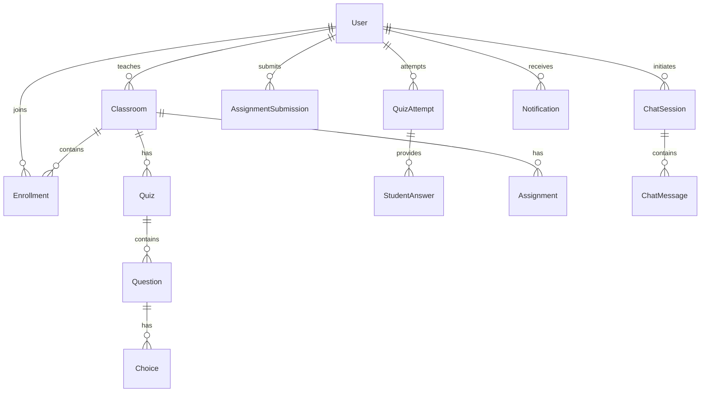

# StudyOS Architecture

## System Diagram

```mermaid
graph TD
    Client[Client Browser / Mobile] -->|HTTPS| RenderWeb[Render Web Service (Gunicorn)]
    
    subgraph Django Application
        RenderWeb --> Auth[core app]
        RenderWeb --> ClassMgr[classroom app]
        RenderWeb --> Assessment[quiz & assignment apps]
        RenderWeb --> AI[ai_learning app]
        RenderWeb --> Analytics[analytics app]
        RenderWeb --> Notifications[attendance & notifications apps]
    end
    
    Assessment --> DB[(PostgreSQL)]
    ClassMgr --> DB
    Auth --> DB
    AI --> DB
    Analytics --> DB
    
    AI -.->|REST API| Gemini[Google Gemini API]
```

## Entity Relationship Diagram (ERD)



## Application Structure

- **`core`**: Custom User model (is_teacher, is_student) and authentication views.
- **`classroom`**: Subject creation, class codes, and student enrollments.
- **`quiz`**: Manual and AI-generated quizzes, questions, choices, and attempt tracking.
- **`assignment`**: File uploads, deadlines, submissions, and grading workflows.
- **`ai_learning`**: Gemini-powered Academic Tutor chat interface.
- **`analytics`**: Data aggregation and Chart.js dashboards for teachers and students.
- **`attendance`**: Tracking active sessions and student presence.
- **`notifications`**: Django signals-based alerts for new content and grades.
