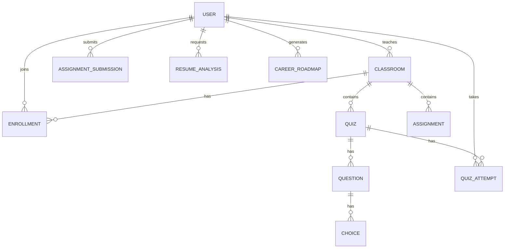

# Database Architecture & ER Diagram

StudyOS uses a highly normalized relational database schema optimized for academic workflows.

## Entity Relationship Summary

### 1. Core Users (`core_user`)
- Extends standard Django `AbstractUser`.
- `is_teacher` (Boolean)
- `is_student` (Boolean)
- `full_name` (String)

### 2. Classroom Module
- **Subject (`classroom_subject`)**: `name`, `code`, `description`.
- **Classroom (`classroom_classroom`)**: `name`, `teacher` (FK to User), `subject` (FK to Subject), `join_code`.
- **Enrollment (`classroom_enrollment`)**: `student` (FK to User), `classroom` (FK to Classroom).

### 3. Quiz Module
- **Quiz (`quiz_quiz`)**: `title`, `classroom` (FK), `teacher` (FK), `passing_marks`, `extra_questions` (JSON).
- **Question (`quiz_question`)**: `quiz` (FK), `text`, `question_type` (MCQ).
- **Choice (`quiz_choice`)**: `question` (FK), `text`, `is_correct`.
- **QuizAttempt (`quiz_quizattempt`)**: `quiz` (FK), `student` (FK), `score`, `percentage`, `submitted_at`.
- **StudentAnswer (`quiz_studentanswer`)**: `attempt` (FK), `question` (FK), `choice` (FK).

### 4. Assignment Module
- **Assignment (`assignment_assignment`)**: `title`, `classroom` (FK), `due_date`, `max_marks`.
- **AssignmentSubmission (`assignment_assignmentsubmission`)**: `assignment` (FK), `student` (FK), `file`, `status` (Pending/Graded), `marks_obtained`.

### 5. Communication & Live Classes
- **Message (`communication_message`)**: `sender` (FK), `receiver` (FK), `content`, `timestamp`.
- **Announcement (`communication_announcement`)**: `classroom` (FK), `title`, `content`.
- **LiveClass (`live_classes_liveclass`)**: `classroom` (FK), `title`, `meeting_link`, `start_time`.

### 6. Career Assistant & Study Notes
- **ResumeAnalysis (`career_assistant_resumeanalysis`)**: `student` (FK), `ats_score`, `analysis_results`.
- **CareerRoadmap (`career_assistant_careerroadmap`)**: `student` (FK), `dream_job`, `roadmap_html`.
- **StudyNote (`study_notes_studynote`)**: `user` (FK), `title`, `summary`, `flashcards`.

## ER Diagram (Mermaid)

